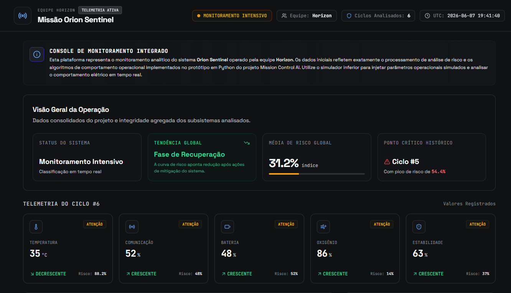
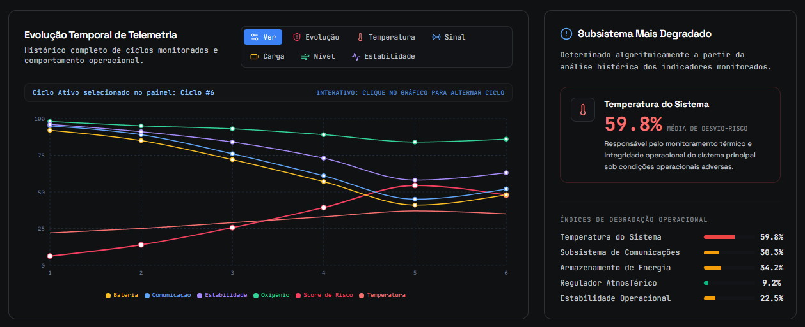
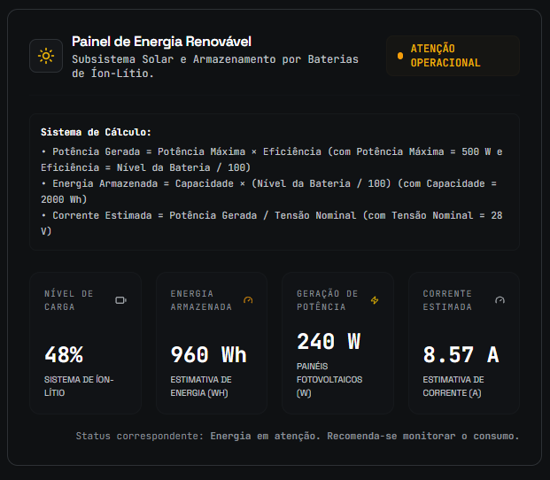
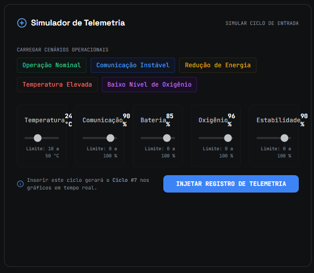
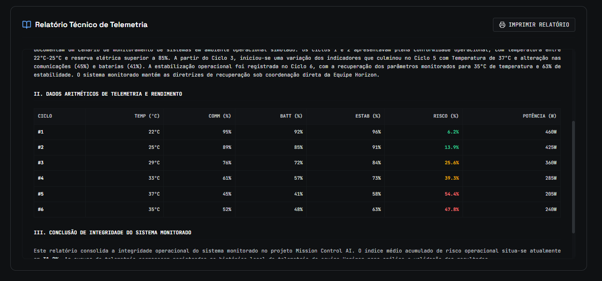

# Mission Control AI

Este projeto consolidado representa uma solução de monitoramento de integridade operacional, desenvolvida como ferramenta educacional de monitoramento e análise de sistemas.

---

## Equipe

* [Alan Souza](https://github.com/alansouza1)
* [Gustavo Zibini Belizario](https://github.com/gustavozibini)

---

## Sobre o Projeto

O **Mission Control AI** é uma plataforma desenvolvida para consolidação de parâmetros de telemetria do sistema **Orion Sentinel**. O sistema traduz os dados operacionais monitorados em interfaces dinâmicas capazes de computar riscos agregados, apresentar o balanço elétrico do Subsistema de Energia Renovável e Sustentável, e emitir relatórios integrados.

Todas as métricas representadas no painel visual são diretamente influenciadas pelos motores analíticos de cálculo derivados do protótipo desenvolvido em Python.

---

## Objetivo

O principal objetivo deste projeto é fornecer uma ferramenta de monitoramento e telemetria operacional para avaliar:
1. **Eficiência de Aquisição**: Processamento confiável de registros operacionais simulados e históricos.
2. **Cálculo de Risco Sistêmico**: Algoritmos matemáticos determinísticos aplicados para ponderar riscos operacionais com base em variáveis de monitoramento cruzadas (Temperatura, Comunicação, Bateria, Oxigênio e Estabilidade).
3. **Análise de Viabilidade Elétrica**: Análise do comportamento energético do subsistema com base no nível de carga disponível, potência gerada, corrente estimada e parâmetros operacionais monitorados.

---

## Estrutura dos Dados de Telemetria

Cada ciclo de missão é representado por cinco indicadores monitorados. Estes valores são organizados conforme a estrutura a seguir:

| Posição | Indicador                | Unidade |
| ------- | ------------------------ | ------- |
| 0       | Temperatura do Sistema   | °C      |
| 1       | Comunicação              | %       |
| 2       | Bateria                  | %       |
| 3       | Oxigênio                 | %       |
| 4       | Estabilidade Operacional | %       |

Estes valores são utilizados tanto pelos cálculos desenvolvidos em Python quanto pela exibição e lógica de monitoramento do dashboard frontend.

---

## Tecnologias Utilizadas

Para garantir legibilidade, manutenibilidade e alto desempenho, a arquitetura foi dividida sob um ecossistema tecnológico moderno e perfeitamente integrado:

*   **Python**: Implementação da lógica de análise de risco, processamento de telemetria e cálculos energéticos utilizados pelo projeto.
*   **React (v18+)**: Framework de base para a construção dos componentes interativos do painel de monitoramento a partir de uma arquitetura modular orientada a estados lineares.
*   **TypeScript**: Camada de tipagem estrita para segurança lógica na manipulação de indicadores de telemetria.
*   **Vite**: Motor de empacotamento ultrarrápido para desenvolvimento frontend sem latência em substituição a ferramentas tradicionais legadas.
*   **Tailwind CSS**: Framework utilitário de CSS para estilização limpa e minimalista de alta legibilidade, garantindo contraste visual adequado no padrão gráfico acadêmico.
*   **Recharts**: Biblioteca especializada de plotagem estatística declarativa e responsiva para a análise temporal dos ciclos de telemetria.

---

## Arquitetura do Projeto

A lógica de processamento operacional segue um fluxo estruturado em duas camadas complementares:

```text
┌───────────────────────────────────┐
│           CAMADA PYTHON           │
│ ───────────────────────────────── │
│ • Análise de Risco                │
│ • Processamento de Telemetria     │
│ • Cálculos Energéticos            │
└─────────────────┬─────────────────┘
                  │
                  ▼
┌───────────────────────────────────┐
│          CAMADA FRONTEND          │
│ ───────────────────────────────── │
│ • Dashboard Interativo            │
│ • Visualização de Indicadores     │
│ • Simulação de Telemetria         │
│ • Relatórios Operacionais         │
└───────────────────────────────────┘
```

### Camada Python

*   **Análise de Risco**: Definição dos critérios analíticos e faixas de gravidade de cada indicador.
*   **Processamento de Telemetria**: Estruturação dos dados e mapeamento das leituras operacionais.
*   **Cálculos Energéticos**: Equações de geração, armazenamento e monitoramento energético.

### Camada Frontend

*   **Dashboard Interativo**: Apresentação visual centralizada com gráficos e cartões dinâmicos de alta reatividade.
*   **Visualização de Indicadores**: Mapeamento inteligente de status e níveis de limite para os subsistemas monitorados.
*   **Simulação de Telemetria**: Possibilidade de injetar ciclos específicos e disparar novos cenários operacionais dinamicamente.
*   **Relatórios Operacionais**: Consolidado analítico de laudo técnico pronto para monitoramento detalhado.

---

## Funcionalidades

### 📊 Monitoramento de Telemetria
Acompanhamento contínuo de 5 métricas chaves organizadas em cartões informativos dinâmicos com codificação de cores intuitiva e adaptativa a riscos.

### 📐 Análise de Risco
Gráficos de evolução histórica cruzando riscos pontuais e agregados ao longo de ciclos discretos. Um analisador de tendências indica cenários como *Estabilidade Operacional*, *Estabilidade Limite*, *Melhora Contínua* ou *Declínio Sistêmico*.

### 🔋 Painel (Subsistema de Energia Renovável e Sustentável)
Monitoramento em tempo real da energia armazenada, potência gerada, corrente estimada e status energético do subsistema.

### 📝 Simulador de Telemetria
Console de injeção que permite registrar manualmente ou carregar cenários operacionais predefinidos para demonstrações práticas, incluindo:
*   **Operação Nominal**: Sistema estável dentro de faixas normais.
*   **Comunicação Instável**: Perda parcial de sinal.
*   **Redução de Energia**: Declínio na reserva de baterias.
*   **Temperatura Elevada**: Cenário operacional utilizado para análise de risco térmico.
*   **Baixo Nível de Oxigênio**: Redução no regulador de ar simulado.

### 📄 Relatório Técnico
Gerador automatizado de laudos técnicos otimizados para exportação/impressão contendo resumos operacionais e tabelas consolidadas dos ciclos processados para fins de auditoria acadêmica.

---

## Estrutura de Pastas

Disposição física para compatibilidade com as diretrizes acadêmicas e estrutura real do repositório:

```text
mission-control-ai/
├── mission_control.py     # Script Python original com equações de risco
├── frontend/             # Aplicação Web de telemetria reativa (React + TS)
│   ├── src/
│   │   ├── components/
│   │   │   ├── charts/   # Gráficos temporais (Recharts)
│   │   │   ├── energy/   # Painel fotovoltaico
│   │   │   ├── layout/   # Cabeçalhos, rodapés e invólucros de página
│   │   │   └── mission/  # Simuladores, KPIs e relatórios analíticos
│   │   ├── domain/       # Motor de cálculos energéticos e análise de risco
│   │   │   └── calculations.ts
│   │   ├── types/        # Declaração de interfaces e enums tipados
│   │   ├── App.tsx       # Ponto de coordenação principal da aplicação
│   │   ├── index.css     # Customização visual via Tailwind
│   │   └── main.tsx      # Ponto de montagem da aplicação
│   ├── vite.config.ts    # Configuração do Vite
│   └── package.json      # Dependências do frontend
└── README.md             # Documentação principal
```

---

## Como Executar o Projeto

### Backend (Python)
Para homologar a lógica computacional pura e os modelos analíticos implementados no protótipo Python:

1. Execute o script de cálculo matemático diretamente no diretório raiz do projeto:
   ```bash
   python mission_control.py
   ```

### Frontend (React/TypeScript)
Para executar a interface gráfica consolidada e simular cenários operacionais em tempo real:

1. Acesse o diretório do frontend:
   ```bash
   cd frontend
   ```
2. Instale as dependências declaradas utilizando o gerenciador de pacotes Node:
   ```bash
   npm install
   ```
3. Inicie o servidor de desenvolvimento:
   ```bash
   npm run dev
   ```
4. Abra o navegador no endereço `http://localhost:3000`.

---

## Capturas de Tela

### Dashboard Principal


### Indicadores de Telemetria


### Painel


### Simulador


### Relatório Técnico


---

## Principais Indicadores Monitorados

O sistema monitora cinco grandes subsistemas cujas flutuações impactam o desempenho e o risco sistêmico geral:

1.  **Temperatura do Sistema**: Monitoramento do gradiente térmico do sistema em °C, utilizado para avaliação de risco operacional.
2.  **Qualidade de Comunicação**: Representa a qualidade da comunicação monitorada pelo sistema.
3.  **Reserva de Baterias**: Capacidade operacional atual registrada no conjunto de baterias de íon-lítio.
4.  **Suporte de Oxigênio**: Indicador relacionado à disponibilidade de oxigênio monitorada pelo sistema.
5.  **Estabilidade Operacional**: Representa a estabilidade geral do sistema monitorado.

---

## Critérios de Classificação de Risco

O Mission Control AI utiliza regras de negócio determinísticas para classificar as condições operacionais de cada indicador.

### Temperatura

| Faixa       | Status  |
| ----------- | ------- |
| 18°C – 30°C | Normal  |
| 30°C – 35°C | Atenção |
| > 35°C      | Crítico |

### Comunicação

| Faixa     | Status  |
| --------- | ------- |
| ≥ 60%     | Normal  |
| 30% – 59% | Atenção |
| < 30%     | Crítico |

### Bateria

| Faixa     | Status  |
| --------- | ------- |
| ≥ 50%     | Normal  |
| 20% – 49% | Atenção |
| < 20%     | Crítico |

### Oxigênio

| Faixa     | Status  |
| --------- | ------- |
| ≥ 90%     | Normal  |
| 80% – 89% | Atenção |
| < 80%     | Crítico |

### Estabilidade Operacional

| Faixa     | Status  |
| --------- | ------- |
| ≥ 70%     | Normal  |
| 40% – 69% | Atenção |
| < 40%     | Crítico |

---

## Classificação Operacional da Missão

A pontuação total de risco ponderada da missão é interpretada de acordo com as seguintes faixas de gravidade:

| Pontuação Total | Classificação     |
| --------------- | ----------------- |
| 0 – 2           | Missão Estável    |
| 3 – 5           | Missão em Atenção |
| 6 – 10          | Missão Crítica    |

Estas regras estão implementadas no protótipo analítico original em Python e são perfeitamente refletidas de maneira dinâmica nas visualizações do dashboard frontend.

---

## Sistema de Energia Renovável

O modelo elétrico e de armazenamento do subsistema baseia-se em equações simplificadas de regulação energética com base na carga acumulada:

### 1. Energia Armazenada
A quantidade de energia armazenada em watt-hora (Wh) no banco de acumuladores de reserva ativa:

$$\text{Energia Armazenada (Wh)} = 2000 \times \left(\frac{\text{Bateria}}{100}\right)$$

Onde:
*   **2000 Wh** representa a capacidade nominal total da bateria de íon-lítio estabelecida em projeto acadêmico.
*   A energia armazenada é diretamente proporcional ao nível percentual de carga ativa monitorada (Bateria %).

### 2. Potência Solar Gerada
O cálculo de potência do subsistema baseia-se no nível de carga do sistema em regulação e acionamento elétrico dinâmico:

$$\text{Potência Gerada (W)} = 500 \times \left(\frac{\text{Bateria}}{100}\right)$$

Onde:
*   **500 W** representa a potência máxima de pico operacional instalada nas placas fotovoltaicas sob as mesmas predições.
*   Para fins acadêmicos, o modelo considera que a potência gerada varia proporcionalmente ao nível de carga monitorado na bateria.

### 3. Corrente Estimada
A corrente de saída ativa (A) é calculada de forma linear em função da potência instantânea dividida por uma tensão nominal fixa estabelecida de **28V**:

$$\text{Corrente Estimada (A)} = \frac{\text{Potência Gerada (W)}}{28\text{V}}$$

Esse equacionamento foi desenvolvido para representar, de forma prática e visual, os conceitos acadêmicos de rendimento de potência e dimensionamento elétrico trabalhados na disciplina.

---

## Parâmetros Utilizados no Modelo

O modelo de monitoramento elétrico e de consumo do subsistema baseia-se nos seguintes parâmetros estruturais:

| Parâmetro                   | Valor              |
| --------------------------- | ------------------ |
| Potência Máxima dos Painéis | 500 W              |
| Tensão Nominal do Sistema   | 28 V               |
| Capacidade da Bateria       | 2000 Wh            |
| Fonte de Energia            | Solar Fotovoltaica |

Estes parâmetros são empregados pelo modelo energético acadêmico para avaliar a eficiência operacional e o comportamento de carga.

---

## Resultados Obtidos

Ao longo das simulações acadêmicas realizadas no projeto:
*   A análise dos indicadores permitiu identificar tendências de variação operacional ao longo dos ciclos monitorados.
*   Os resultados demonstram a influência dos indicadores monitorados sobre o comportamento geral do sistema, fornecendo suporte à tomada de decisão e ao monitoramento operacional.

---

## Licença

Este projeto está licenciado sob os termos da **Licença MIT**. Para maiores informações, consulte o termo padrão de uso aberto.
